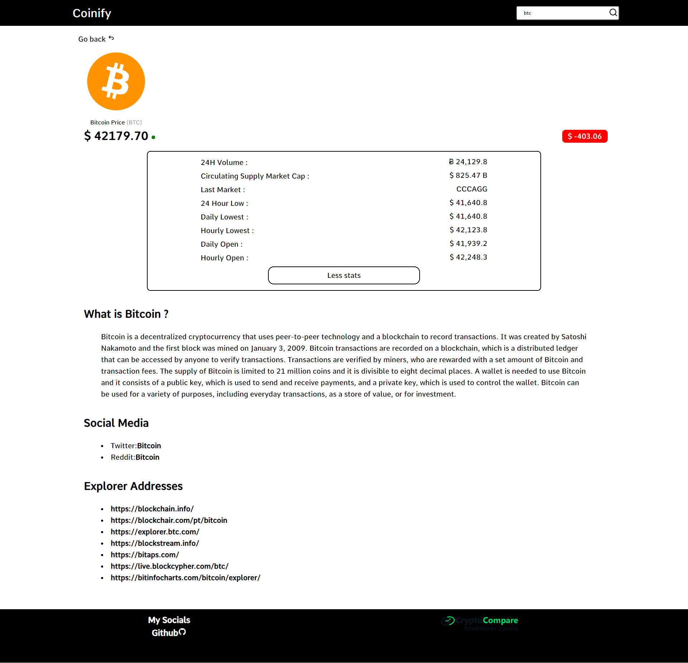
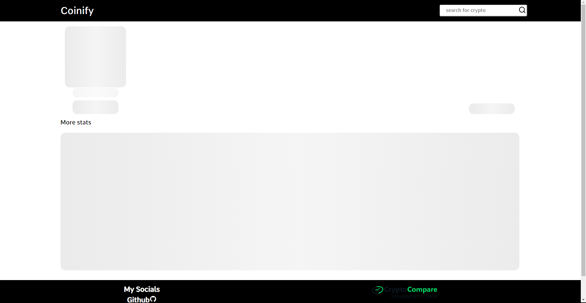
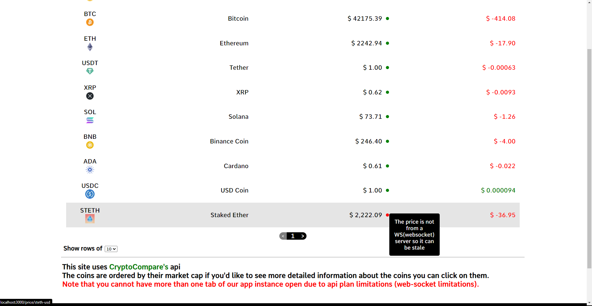

# A Next.js app for crypto prices with cryptocompare's api

## Getting Started

First of all clone the repository , after that you need cryptocompare api key it's free so you can just grab yours from [here](https://min-api.cryptocompare.com/) and you must put your key to .env.local file ,then do

```bash
npm install
# or
yarn add
```

lastly do

```bash
npm run dev
# or
yarn dev
```

Open [http://localhost:3000](http://localhost:3000) on your browser to see the app.

Here are some screenshots from the web app.

<p align="center">
    
</p>
<p align="center">
    
</p>
<p align="center">
    
</p>
<p align="center">
    
</p>

### Please note that you can only have one tab open of the app because of websocket limitations of api plan

## Missing things that could have been implemented

- Adding support for other currencies (only USD available for now)
- More information could be shown on detailed page e.g. coin whitepaper...

Contact me at contactuncor3@gmail.com
